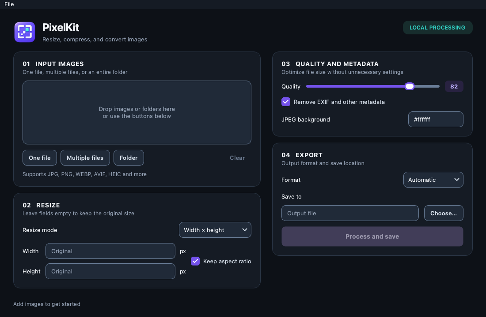
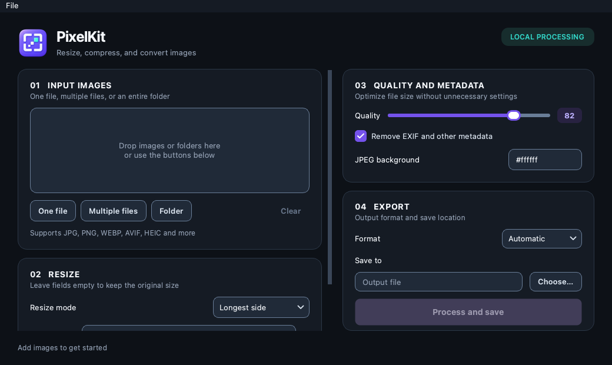
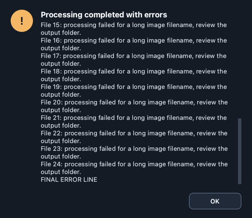

# Візуальний аудит PixelKit

Дата: 3 жовтня 2026 року. Перевірено актуальний Qt-інтерфейс після видалення секції Preview. Виявлені нижче проблеми виправлено у вихідному коді та в окремій macOS-збірці.

Найсуттєвіші проблеми стосувалися видимості станів: у чекбоксах не було галочок, у списках вибору — стрілок, кнопка обробки була активною без зображень, довгі назви й повідомлення обрізалися. Темну палітру, логотип та чотири основні секції збережено.

## Обсяг перевірки

Перевірено композицію, відступи, типографіку, контраст, іконки, поля, списки, кнопки, фокус із клавіатури, порожній і заповнений екрани, стан обробки, повідомлення та поведінку при зміні розміру вікна.

- macOS 26, Apple Silicon, PyQt6 6.11 / Qt 6.11; реальна упакована апка на Retina-дисплеї.
- Розміри вікна: стандартний 1100 × 720, мінімальний 1040 × 620 та збільшений 1600 × 1000. Це логічні пікселі інтерфейсу.
- Контрольовані знімки Qt для 19 станів. Для порівняння використовувалися локально створені тестові зображення, включно з пакетом із 35 файлів і назвою приблизно на 180 символів.
- У новій нативній macOS-збірці окремо пройдено сценарій вибору PNG через системний діалог, обробки, збереження, показу результату й очищення списку.

## Знахідки та виправлення

P1 — проблема приховувала важливу інформацію або створювала суперечливий стан; P2 — ускладнювала читання чи взаємодію; P3 — порушувала візуальну узгодженість.

| Пріоритет | Знахідка до аудиту | Результат після виправлення |
| --- | --- | --- |
| P1 | Довгі повідомлення помилок могли обрізатися; розрахунок висоти до застосування шрифту приховував останні рядки. | Текст переноситься й прокручується, висота повторно обчислюється після застосування стилю. Перевірено доступність останнього рядка. Кнопки залишаються видимими. |
| P1 | Під час обробки можна було змінювати параметри та джерела, хоча поточне завдання вже використовувало попередні значення. | На час обробки джерела, параметри й місце збереження блокуються. Кнопка показує «Processing…», після завершення доступ відновлюється. |
| P2 | Увімкнені чекбокси виглядали як кольорові квадрати без галочок. | Додано чітку SVG-галочку. Стани увімкнено / вимкнено розрізняються формою та кольором. |
| P2 | У випадаючих списках не було видимої стрілки. | Додано SVG-стрілку для режиму зміни розміру та формату. Обидва ресурси включено в macOS-пакунок. |
| P2 | Контраст тексту головної кнопки та меж полів був недостатнім за обраними орієнтирами доступності. | Затемнено фіолетовий фон кнопки, підсилено межі інтерактивних елементів. Конкретні вимірювання наведено нижче. |
| P2 | Фокус клавіатури був слабким або відсутнім для частини елементів. | Поля, списки, звичайні кнопки, чекбокси та повзунок отримали бірюзовий індикатор фокуса; головна кнопка — світлу рамку. |
| P2 | «Process and save» була активною на порожньому екрані; порожній список містив службовий рядок як елемент. | Кнопка активується після вибору джерела й місця збереження. Порожня підказка розташована всередині області списку, але не є файлом. «Clear» також вимикається без файлів. |
| P2 | Довгі назви провокували горизонтальну прокрутку та незручне обрізання тексту; статус конкурував із прогресом за місце. | У списку й статусі використано скорочення посередині. Повний текст доступний у підказці; повний статус також передається через доступну назву. Горизонтальну прокрутку списку прибрано. |
| P2 | Пояснення режиму «Longest side» стискало поле введення. | Пояснення перенесено під рядок. На мінімальному розмірі ширина поля зросла зі 123 до 364 px. |
| P2 | Шлях збереження мав тільки placeholder, а вручну введений шлях міг замінюватися при зміні формату. | Додано постійну мітку «Save to» й підказку з повним шляхом. Ручний вибір місця збереження зберігається при зміні формату. |
| P3 | Змішувалися одиниці шрифтів, символи замість іконок і технічний бейдж «QT6 HIGH DPI». | Уніфіковано розміри шрифтів у стилях та успадкування системного сімейства. Кнопки мають прості текстові назви; бейдж пояснює користувачу «LOCAL PROCESSING». |
| P3 | Велике вікно не давало більше видимих файлів; повідомлення різних типів виглядали однаково. | Список збільшується зі 145 до максимум 320 px залежно від висоти вікна. Інформаційні, попереджувальні та критичні повідомлення мають різні кольори й символи. |

Усі наведені виправлення виконано. У перевірених станах після виправлень не спостерігалося перекриття основних контролів або недоступних через обрізання кнопок.

## Контраст і доступність

Контраст обчислено з кольорів стилів за формулою відносної яскравості sRGB. Як практичні орієнтири використано 4,5:1 для звичайного тексту та 3:1 для значущих меж елементів. Ці значення описано в [WCAG: Contrast Minimum](https://www.w3.org/WAI/WCAG22/Understanding/contrast-minimum.html) і [WCAG: Non-text Contrast](https://www.w3.org/WAI/WCAG22/Understanding/non-text-contrast.html). Це перевірка окремих властивостей інтерфейсу, а не підтвердження повної відповідності WCAG.

| Пара кольорів | До | Після |
| --- | ---: | ---: |
| Білий текст / фон головної кнопки | 4,35:1 | 5,06:1 |
| Білий текст / фон головної кнопки при наведенні | 3,31:1 | 4,73:1 |
| Межа поля / фон поля | 1,20:1 | 3,44:1 |
| Допоміжний текст / фон картки | 6,52:1 | 6,52:1 |

Новий бірюзовий колір фокуса має контраст 7,99:1 відносно фону поля. Для вимкнених елементів збережено приглушений вигляд; наведені текстові пороги не застосовувалися до їхніх неактивних станів.

До важливих полів додано доступні назви та опис призначення. Перевірено відображення фокуса на полях, чекбоксах, кнопках і повзунку. Системний діалог вибору файлу залишається нативним діалогом macOS.

## Композиція, типографіка й адаптація

Чотири секції мають послідовну нумерацію: джерела → розмір → якість → експорт. Ліва колонка містить джерела та розмір, права — якість та експорт. Головна дія розміщена разом із результатом і місцем збереження. Секцію Preview не відновлено.

Заголовок апки, заголовки секцій, основні мітки та допоміжний текст мають окремі рівні розміру й насиченості. Повторювані поля, кнопки та картки використовують спільні стилі. Декоративні межі карток залишаються стриманими, а межі інтерактивних контролів помітніші.

На мінімальному розмірі нижня частина лівої колонки доступна вертикальною прокруткою. На стандартному розмірі основні секції поміщаються без неї. На великому розмірі збільшується кількість видимих рядків файлів. Мінімальний розмір вікна залишається 1040 × 620.

## Перевірені стани

| Стан | Що перевірено |
| --- | --- |
| Порожній екран | Підказка додавання, відсутність фальшивого файлу, неактивні «Clear» і головна дія. |
| Один файл із довгою назвою | Назва, відомості про зображення, шлях збереження, скорочення й підказки. |
| Пакет із 35 файлів | Прокрутка, кількість джерел, метадані першого файлу, режим папки для результатів. |
| Width × height / Longest side | Мітки, одиниці px, ширина полів, підказка режиму, чекбокс пропорцій. |
| Якість 82 / 100, чекбокси увімкнено / вимкнено | Повзунок, числовий бейдж, галочки та відмінність станів. |
| Випадаючий список формату | Стрілка, список варіантів, виділення та текст. |
| Наведення, натискання, фокус | Головна кнопка, поля, чекбокси й повзунок. |
| Обробка з довгою назвою | Блокування налаштувань, напис кнопки, прогрес і статус у межах вікна. |
| Підтвердження перезапису | Довгий шлях, перенос тексту, видимі кнопки; типовою дією є «No». |
| Довгі повідомлення помилок | Обмежена висота, прокрутка, можливість виділити текст і доступ до останнього рядка. |
| Успішне завершення | Кількість оброблених файлів, шлях результату й відновлення доступності контролів. |
| Мінімальне та велике вікна | Вертикальна прокрутка лівої колонки, відсутність горизонтального переповнення списку. |

Контрольовані знімки розміщено в [папці після виправлень](after), початкові — у [папці до виправлень](before). Геометрію та стани кнопок зафіксовано в [метриках до](before/metrics.json) і [метриках після](after/metrics.json).

### Основний екран після виправлень

### Мінімальне вікно, режим Longest side

### Кінець довгого повідомлення помилок

## Перевірка коду та збірки

- 14 автоматичних перевірок пройшли. Вони включають блокування та відновлення контролів під час обробки, збереження вручну введеного місця експорту, відкриття файлів і роботу середовища виконання.
- Перевірки синтаксису та форматування змін пройшли.
- Нова macOS-збірка перевірила підписи, залежності всередині пакунка й запуск упакованого Qt-інтерфейсу з мінімальним середовищем.
- У пакунку пройшло кодування та декодування 9 форматів: JPG, PNG, WEBP, AVIF, GIF, BMP, TIFF, HEIC і ICO.
- Реальний запуск нової `.app` та збереження тестового PNG підтверджено через інтерфейс macOS.

Це історичний звіт станом на дату аудиту; тимчасові логи пакування не зберігаються в документації.

## Результат і межі аудиту

Оновлений інтерфейс увійшов у наступні версії PixelKit. Інструкція відтворення актуальної macOS-збірки: [пакування для macOS](../../packaging/macos/README.md). Локальна перевірка аудиту виконувалася на Apple Silicon і macOS 26.

Візуальні виправлення внесено до спільного Qt-коду. Нативний вигляд на Windows та Intel Mac у цьому середовищі не перевірявся, а наявний Windows-інсталятор не перебудовувався. Аудит охоплює основну Qt-апку; старий Tkinter-інтерфейс не перевірявся.

Окрема перевірка VoiceOver, усіх системних масштабів і режимів підвищеного контрасту не проводилася. Вона потрібна для ширшої заяви про доступність. Наступна перевірка перед розповсюдженням має охопити Windows при масштабах 100%, 125%, 150% і 200%, а також Intel macOS. Підтверджених невиправлених дефектів у перевіреній матриці станів не залишилося.
